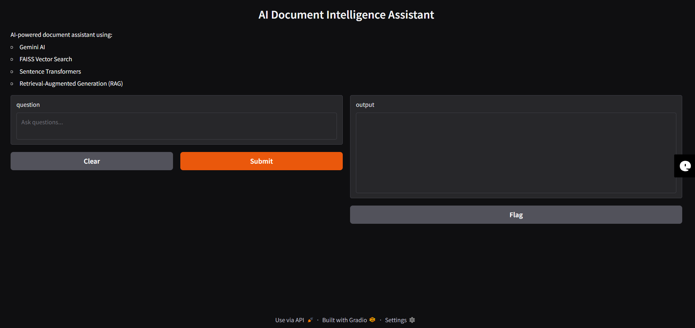
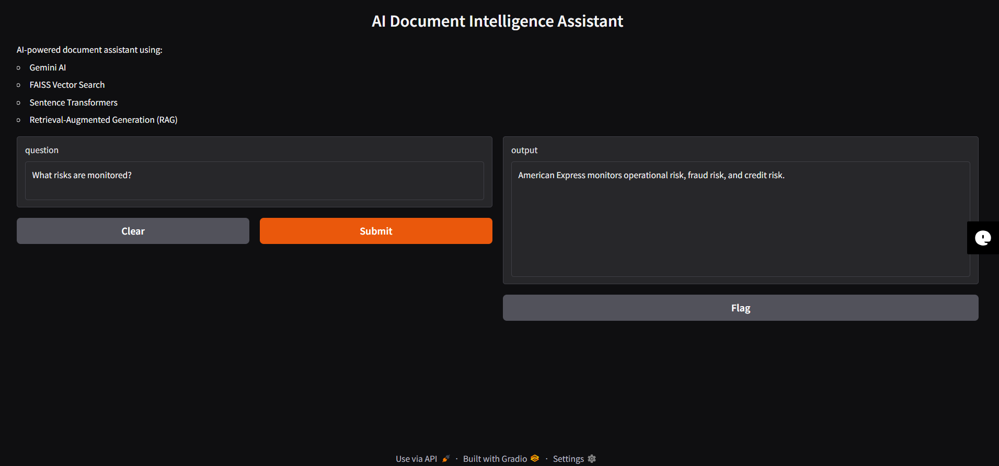

# AI Document Intelligence Assistant

An AI-powered document chatbot built using Gemini AI, FAISS vector database, and Sentence Transformers.

---

## Features

- Context-aware question answering
- Semantic document retrieval
- Vector similarity search
- AI-generated responses
- Interactive chatbot UI

---

## Tech Stack

- Python
- Gemini API
- FAISS
- Sentence Transformers
- Gradio
- NumPy

---

## Workflow

1. Convert documents into embeddings
2. Store embeddings in FAISS vector database
3. Retrieve relevant context using semantic similarity
4. Generate AI responses using Gemini

---

## Example Questions

- What risks are monitored?
- Which technologies are used?
- Why are machine learning models used?

---

## Screenshots

### Chatbot UI

### AI Response Example

---

## Future Improvements

- PDF Upload
- Multi-document support
- Cloud deployment
- Chat history

---

## Author

Aryan Singh
